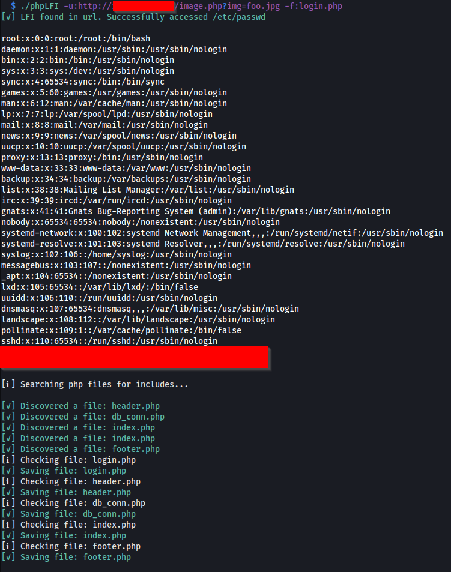

# phpLFI
Tests for LFI in PHP apps and automates the process of abusing LFI's to download source code and discover new files via includes and recursively download additional source code files.

## Install

 ```
 git clone https://github.com/sdcampbell/phpLFI
 cd phpLFI
 nimble build
 ```

## Run
Give it at least one php file for the -f option. I recommend you run gobuster/ffuf/dirb/dirsearch/etc with the wordlist "SecLists/Discovery/Web-Content/Common-PHP-Filenames.txt" (not included, get it from: https://github.com/danielmiessler/SecLists) to discover more php files and feed any discovered words to the -f parameter as comma separated values.

Please note that this program is limited to discovering and exploiting LFI in PHP only, and only when a single '=' appears in the URL. I may add the ability to test/exploit multiple params at a later date, but feel free to contribute that feature if you need it and can't wait. :)


